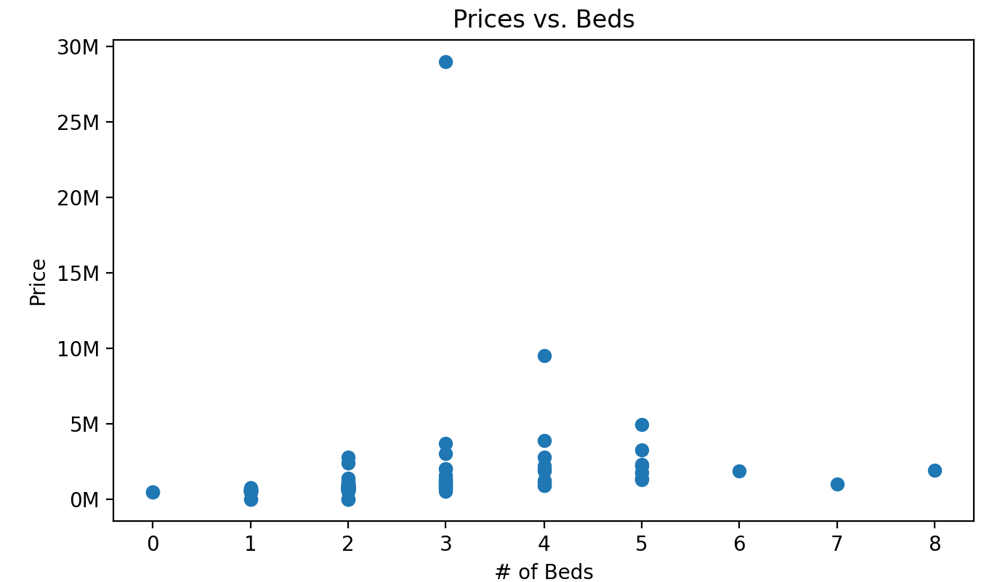
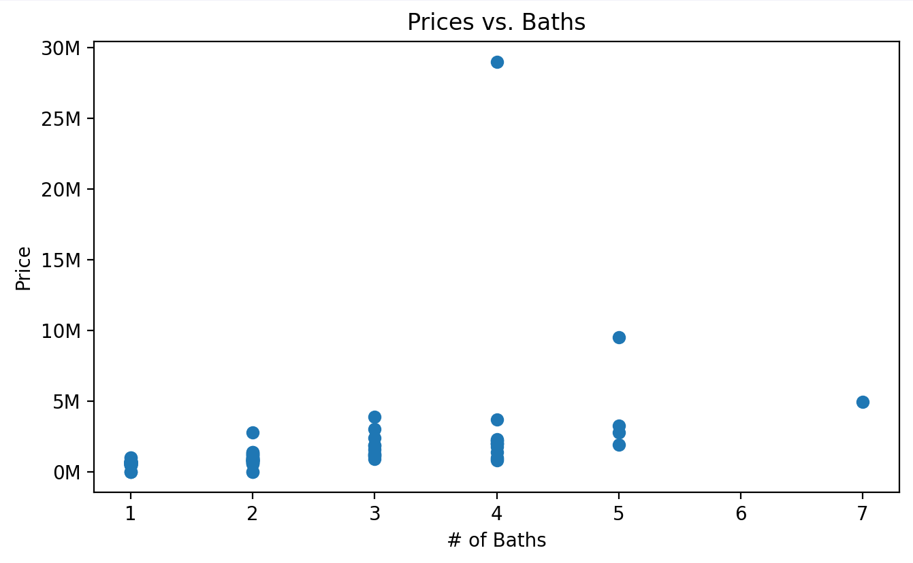
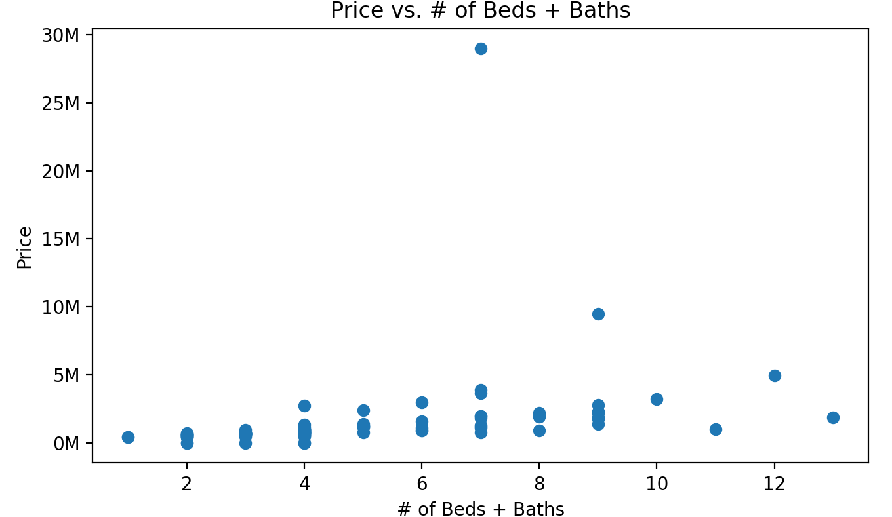
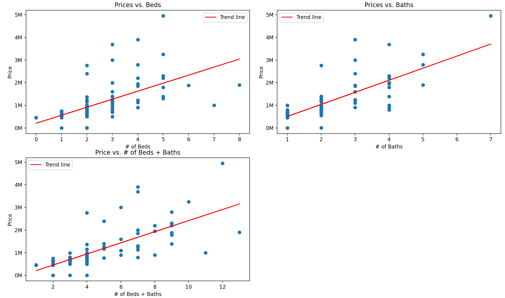
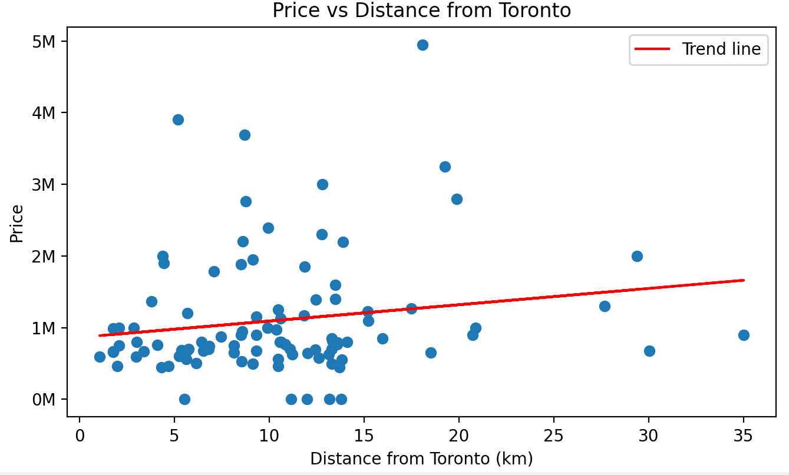

# Toronto Housing Market Analysis
 Gathering information about the housing market in the GTA.

 Run requirements.txt to download all the necessary libraries/frameworks.

 Last updated: 5:25PM PDT, 5/9/24 (Relavent for Toronto_listings.csv)

 # BASED ON 2025-05-09 LISTINGS

I predict that as the prices go up, the number of bedrooms and bathrooms should increase.

As prices go down, the number of bedrooms and bathrooms should decrease.
##### Scatter Plot Data:

Looks like there is an anomaly in the data, lets remove it and try it again (by removing listings that are greater than 8 million)

After removing the anomalies, the data looks like this:

##### Therefore we can conclude that as the price of houses goes up, the number of beds and/or baths will also go up.

----------------------------------------------------
I predict that the closer the location to the downtown Toronto, the higher the price. 
(Will need to use geographical location to find this out)
###### Would I be able to get an api (like maps) to get a general location of the property, and correlate that if the closer it is to downtown, the more expensive it is?
##### UPDATE: Tried, apis do not like my multiple request calls. Could work if I use Google Maps however I am scared I might get charged money trying. :(

###### Update 2: Was able to get an api working :D

Based on the data created using the google maps api, we have gotten the following graph (for 2024-05-09 house listings):

This was very interesting as it has proven my hypothesis wrong, as it does not seem like the prices of houses are more expensive the closer it is to Toronto. I suspect that because the number of beds and baths are not consistent in this data set, this graph does not provide anything useful.

---------------------------
# TO DO:

Create graph of price of houses vs distance from Toronto, and have the same amount of bed/bath for
each listing.

~~Webscrape first Toronto listing from remax.ca~~

~~Gather Data from first page~~

~~Gather Data from multiple pages~~

~~Store data~~

~~Each time script is run, make the csv the name of the date ran~~

~~Analyse data~~

Optional:

Automate Process

Allow input from user (bedroom,bath,location,price,etc.)
