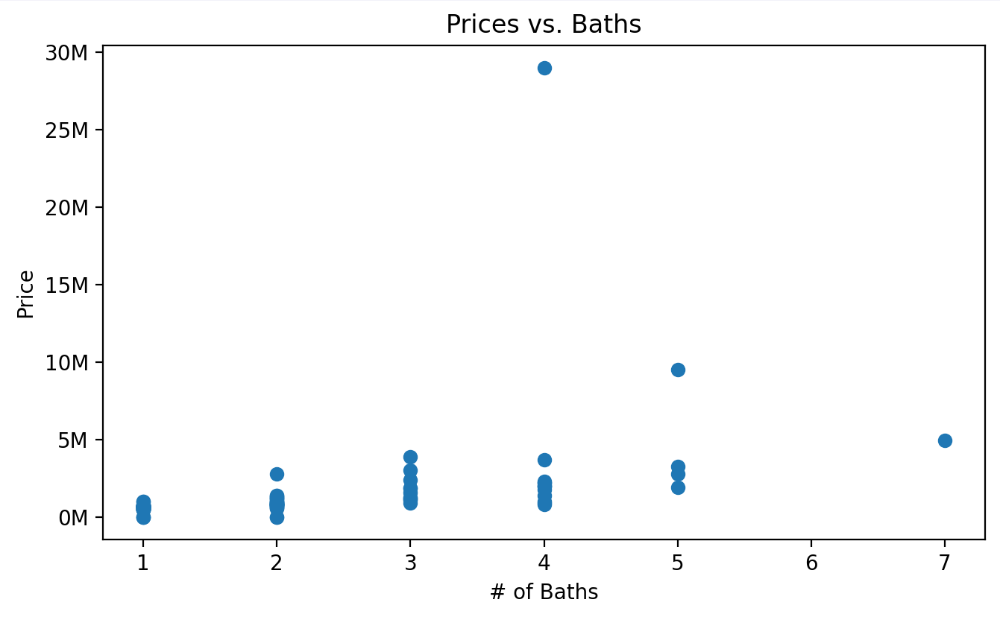
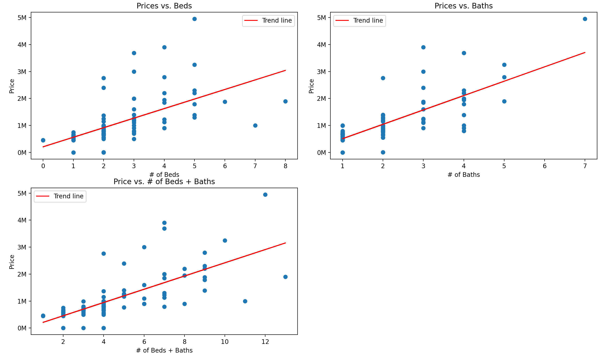

# BASED ON 2025-05-09 LISTINGS

I predict that as the prices go up, the number of bedrooms and bathrooms should increase.

As prices go down, the number of bedrooms and bathrooms should decrease.
##### Scatter Plot Data:

Looks like there is an anomaly in the data, lets remove it and try it again (by removing listings that are greater than 8 million)

After removing the anomalies, the data looks like this:

##### Therefore we can conclude that as the price of houses goes up, the number of beds and/or baths will also go up.

----------------------------------------------------
I predict that the closer the location to the downtown Toronto, the higher the price. 
(Will need to use geographical location to find this out)
